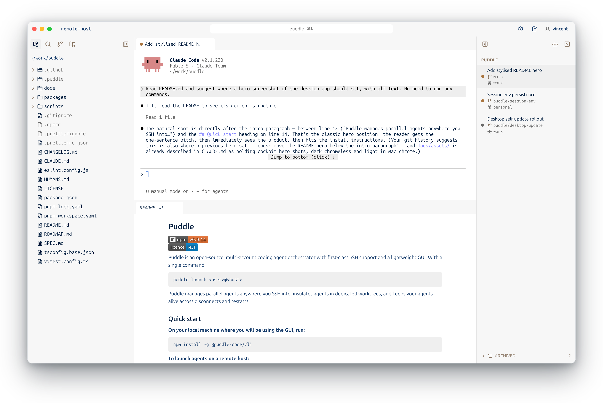

# Puddle

[](https://www.npmjs.com/package/@puddle-code/cli)
[](LICENSE)

Puddle is an open-source, multi-account coding agent orchestrator with first-class SSH support and a lightweight GUI. With a single command,

```bash
puddle launch <user>@<host>
```

Puddle manages parallel agents anywhere you SSH into, insulates agents in dedicated worktrees, and keeps your agents alive across disconnects and restarts.

<p align="center">
  <picture>
    <source media="(prefers-color-scheme: dark)" srcset="docs/assets/cockpit-dark.png">
    
  </picture>
</p>

## Quick start

**On your local machine where you will be using the GUI:**

For a standalone installation without Node.js or npm, use your deployed app's
installer (replace the example host):

```sh
curl -fsSL https://app.example.com/install.sh | sh
```

This installs the CLI under `~/.local/share/puddle/cli` and its launcher at
`~/.local/bin/puddle`. Add `~/.local/bin` to your `PATH` if the installer asks.
The standalone releases support Linux x64/arm64 and macOS arm64. The script and
checksum-verified archives are also attached to this repository's GitHub Releases.
An optional `--version` selects a release; `--prefix` and `--bin-dir` select the
installation and launcher directories:

```sh
curl -fsSL https://app.example.com/install.sh | sh -s -- --version X.Y.Z
```

Alternatively, with Node.js already installed, use npm:

```sh
npm install -g @puddle-code/cli
```

**To launch agents on a remote host:**

```sh
puddle launch <user>@<host>
```

This connects Puddle to the remote host over SSH, bootstrapping the Puddle daemon on first contact and enabling you to begin development.

**To connect from a phone or another browser over the internet:** deploy your own
[mobile access service and trusted web application](docs/mobile-access.md), then
use `puddle remote enable` and `puddle remote pair`. The host connects outward;
there is no public daemon port or VPN requirement. Each browser needs explicit
host approval. The phone view provides live terminals, prompt input and read-only
text/diff review over a pinned Noise connection through the relay.

Puddle works using your system `ssh`, so `~/.ssh/config`, agents, and jump hosts apply.

**For development on your own machine:**

```sh
puddle launch
```

This installs the Puddle daemon under `~/.puddle` and serves the GUI at `http://localhost:7433`.

Ctrl-C normally closes only the GUI while agent sessions keep running. On an SSH host that reaps
detached processes, Puddle instead keeps the daemon attached to the cockpit; closing it interrupts
live processes. The next `puddle launch` restarts the daemon from the host's persistent state and,
when auto-resume is enabled (the default), restores the interrupted sessions.

The [deployed app](docs/mobile-access.md#host-the-installer) serves `/install.sh`
as the single public installer. Install daemon and desktop components through
`puddle install daemon [user@host]` and `puddle install desktop`. A first
`puddle launch user@host` still installs a missing daemon automatically from
GitHub Releases.

**Managing components:**

The CLI installs, upgrades, and removes all three components — daemon, desktop app, and itself — with optional versions and SSH targets:

```sh
puddle upgrade                            # everything installed → the newest release
puddle install daemon@v0.0.32 user@host   # pin a host's daemon to a version
puddle remove daemon                      # uninstall; your data stays unless you --purge
```

**Desktop app (optional):**

The same cockpit also ships as a standalone desktop app — identical UI and engine, plus a File → "Connect to SSH Host…" menu for remote hosts. Install it with `puddle install desktop` (macOS arm64 or Linux x64). Once installed, it runs independently of the CLI.

An installed Puddle CLI manages the desktop app directly: quit Puddle, then `puddle install desktop`, `puddle upgrade desktop`, or `puddle remove desktop`. On macOS a fresh install goes to `/Applications` when writable, otherwise `~/Applications`; on Linux `install desktop` asks where to put the AppImage (default `~/puddle`) and opens the folder — later updates happen from inside the app.

**Host requirements**: Linux with glibc 2.28+ (Ubuntu 20.04+, Debian 11+, RHEL/Rocky 8+;
Alpine is not supported) or macOS, with `git` and `curl`, plus whichever agent CLIs you want on
`PATH`. Standalone CLI installs include Node and require no npm; npm installs require Node 22+. The client side works from any OS with a browser and `ssh` (Windows works, with repeated
auth prompts unless you use a key).

## How it works

- **The Puddle daemon works anywhere you can SSH into.** It is installed on your host during every fresh connect, relaying information across SSH to your local GUI. The daemon is the parent of every agent process, keeping sessions running when your laptop sleeps, the window closes, or the SSH connection drops. Puddle also maintains a stateful memory of your conversations to survive machine reboots.
- **Puddle orchestrates parallel isolated agents** each working in a unique git worktree and branch. You can choose the branch and worktree during session creation.
- **Puddle's lightweight GUI** allows you to track agent progress, session usage, and active worktrees.
- **Puddle's philosophy is that any good developer must stay grounded in their code.** Puddle natively integrates live terminals, file editing in Monaco, git commit grahps, diff views, and opens worktrees in your favourite IDE.
- **Multiple profiles and accounts** enable several collaborators to collaborate on a shared remote host. Puddle manages multiple accounts per agent type and profile, symlinking conversation histories so you can run from multiple Claude Code accounts at once and move your conversations between each.

```
 client machine                          host machine (local or remote)
┌──────────────────────────────┐        ┌───────────────────────────────────┐
│ browser ── localhost:7433    │        │  puddled  (systemd user service)  │
│               │              │ local: │   ├─ REST + WS API                │
│  puddle CLI ◄─┘              │ direct │   ├─ PTY manager                  │
│   ├─ static web UI assets    │───────►│   ├─ git worktree manager         │
│   └─ /api + /ws proxy        │ remote:│   ├─ per-agent adapters           │
└──────────────────────────────┘ ssh -L │   └─ SQLite + append-only logs    │
                                        └───────────────────────────────────┘
```

The CLI serves the UI at a stable local origin and reverse-proxies the API to the daemon, directly in local mode, through the tunnel in SSH mode. The daemon is headless and host-agnostic on `127.0.0.1:7434`. UI updates ship with the CLI (`puddle upgrade cli` refreshes the cockpit for every host); the daemon only has to update when the versioned protocol breaks, and the launcher asks for approval before updating it. The prompt shows the host, both protocols and how many live sessions the restart interrupts; declining leaves the daemon running. `--no-upgrade` refuses before prompting, and non-interactive launches require an explicit `puddle upgrade daemon [user@host]` first. Short-lived host connection leases, separate browser authorisation and exact cockpit Host/Origin checks guard local access. Launch invitations are single-use; browser login survives cockpit restarts, while forwarded applications use a separate loopback origin. After upgrading from the old token flow, run `puddle launch` once to authorise existing tabs.

Everything lives under `~/.puddle` on the host, installed without sudo — and `puddle remove daemon` takes it apart again.

## Development & teardown

**One daemon, many clients.** There is a single local daemon per machine, living under `~/.puddle` and run by one supervised service (launchd's `dev.puddle.puddled` on macOS, systemd's `puddled` on Linux). The global `puddle` and a repo-run `node packages/cli/dist/index.js` are **both just clients** that talk to — and, when needed, install — that same daemon. They never run side by side, and there is no separate "dev daemon" alongside a "production daemon".

**Dev build vs. production.** The standalone installer or `npm i -g @puddle-code/cli` is the production path — its `puddle` fetches and upgrades the daemon from this repo's GitHub Releases. To exercise uncommitted changes, build and run from the repo:

```sh
pnpm build && pnpm build:tarball
node packages/cli/dist/index.js launch --tarball dist-release/puddled-v*.tar.gz --foreground
```

`--tarball` sets the install _source_ only, and is consulted **only when the CLI actually installs the daemon** — when none is running, the daemon is stopped, or a protocol-major upgrade fires. If a compatible daemon (same protocol major) is already up, `launch` just serves the cockpit against it and **the tarball is ignored** (even a newer app version — nothing compares app versions). So to load a fresh dev build over a running daemon you must **stop it first** (see _Kill_ below), then re-run `launch --tarball …`. `--foreground` keeps the cockpit attached (`launch <user>@<host> --tarball …` is the remote form). Both clients share one `~/.puddle` daemon and cockpit registry, so `puddle list` / `puddle kill` see either — don't point both at the same host at once. (Never launch the daemon from inside a coding-agent shell: it inherits the agent's env and breaks conversation resume — use a plain terminal.)

**Kill.** `puddle kill --all` (or Ctrl-C in a `--foreground` run) normally stops the local cockpit
UI only; a supervised daemon and its sessions keep running. When launch reported that it is keeping
the daemon attached over SSH, killing that cockpit cleanly interrupts its processes instead; the
next launch reconciles them from `~/.puddle` and auto-resumes them when that host setting is enabled.
A supervised daemon is auto-restarting
(launchd `KeepAlive`, systemd `Restart=always`), so a plain `kill <pid>` bounces straight back — stop
it through its supervisor:

```sh
launchctl bootout gui/$(id -u)/dev.puddle.puddled   # macOS (launchd)
systemctl --user disable --now puddled              # Linux (systemd user unit)
kill "$(cat ~/.puddle/puddled.pid)"                 # nohup fallback (no supervisor)
```

**Restore the production daemon.** When you're done testing, `puddle remove daemon` (answer no to the purge question — your profiles, sessions, and worktrees stay), then run the production `puddle launch`, which refetches the daemon from GitHub Releases. (Removal is what forces the refetch: the installer skips a version whose files are already present, so a dev build sharing the release's version number would otherwise stay put.)

**Uninstall.** Removing the CLI alone leaves the daemon installed and running — a full teardown is:

```sh
puddle remove daemon --purge   # stops the daemon, unregisters its service, deletes ~/.puddle
puddle remove cli              # standalone or npm removal, using its installation channel
```

> ⚠️ `~/.puddle` **is** your local state — the SQLite database with every profile, account, and session (plus conversation history), the daemon's worktree tracking, and the auth token. `--purge` deletes it irreversibly (the command lists dirty or unpushed worktrees and asks first); without it, `puddle remove daemon` keeps the data for a later reinstall.

## Licence

Puddle is licensed under the [MIT License](LICENSE). Copyright (c) 2026 Yiding Song.
