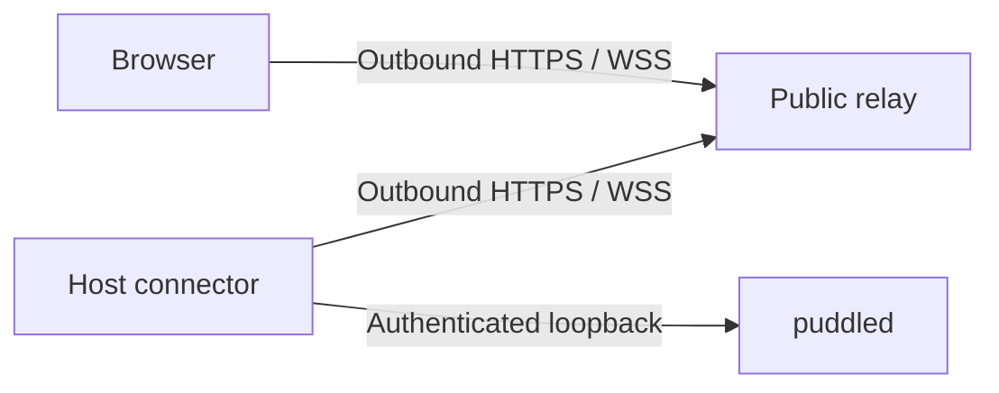
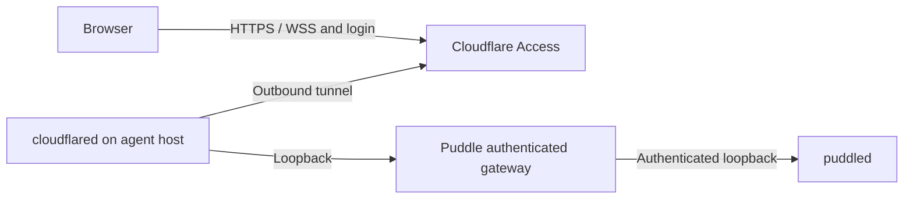

# Mobile access

Status: deferred. The [connection-token foundation](short-lived-connection-tokens.md)
is implemented for local and SSH access in protocol 18.0, with separate
[manual acceptance](../acceptance/connection-authority.md). No mobile connector,
relay, internet gateway or device-pairing flow is implemented.

The mobile requirement remains access from an ordinary browser over the
internet, without a VPN or a client-side installation. The recommended later
product direction is an outbound host connector with a hosted or self-hosted
relay. Tailscale remains an optional transport, not a prerequisite.

## What exists

- The CLI serves the web UI and proxies the daemon over loopback or an SSH
  tunnel. Both servers enforce localhost Host/Origin checks. Merely putting
  a reverse proxy in front of the cockpit does not provide supported mobile
  access (`packages/cli/src/lib/serve/`, `packages/daemon/src/security/`).
- The browser stores a cockpit-only credential in origin-scoped localStorage.
  Login survives cockpit replacement, with 30-day inactivity expiry; private
  cockpit state stores only verifiers. Host tokens are short-lived and stay
  inside the cockpit process. This is not remote phone enrolment or pairing.
- The workspace already has narrow-screen rails, dismissible sidebar
  overlays, and controls visible on touch devices (SPEC §12). Its central
  area still renders the desktop tiling tree.
- WebSocket reconnect restores terminal attachments and canonical terminal
  snapshots. A PTY has one size; the most recent attach/resize wins, and
  focusing a viewer reclaims its size (SPEC §6).
- Open windows keep separate working sets, but layout changes update the
  profile's shared seed for future windows. A mobile presentation must not
  overwrite that seed merely to fit the screen.

The [connection authentication design](connection-auth.md) explains the shared
architecture. The separate [connection-token implementation contract](short-lived-connection-tokens.md)
owns first-phase implementation, migration, and acceptance. Mobile and relay
work will reuse the completed foundation. Remote identity, encryption, and
hosting decisions below do not block its implementation or release.

## Product direction: outbound connector and relay

Use the existing web application from the phone's browser. Keep execution,
filesystem access, terminal history, and the daemon token on the host. A
persistent connector alongside `puddled` initiates an outbound connection to
a public relay. The browser also connects out to that relay; established
connections carry traffic in both directions.

The agent machine needs no publicly reachable listener or router port
forwarding. The relay needs a public HTTPS endpoint. Registering an outbound
connection does not itself authorise the traffic arriving over it: the host
connector remains an authentication and authorisation boundary.

This topology is supported by the
[Claude Code Remote Control documentation](https://code.claude.com/docs/en/remote-control#connection-and-security):
the local process registers and polls through outbound HTTPS, with traffic
routed through the service using TLS and short-lived credentials. That service
also stores synchronised transcripts while execution stays local. These are
transport-encryption guarantees, not a documented promise of content secrecy
from the provider. Puddle can adopt the topology without adopting server-side
transcript storage.

Offer the same relay protocol in hosted and self-hosted deployments. The hosted
option supplies the intended low-setup experience; self-hosting requires a
public endpoint, certificates, authentication, and service operation. Neither
requires software on the browsing device. Hosting a default relay is a separate
operational commitment, not functionality the current project already offers.

Run the connector under a persistent supervisor on the machine running the
agents. Access to a remote server should not depend on the user's laptop or
its SSH tunnel staying open. A sleeping host is unavailable; reconnect does
not move execution into the cloud. The existing SSH-attached daemon fallback
still has its cockpit-bound lifetime (SPEC §10); independent remote access
requires addressing that deployment explicitly.

First-version phone tasks: choose a project/session, view live terminal
output, enter prompts, answer agent prompts through the terminal, interrupt
work, and review text changes. Pairing grants the owner's host-level control:
profiles remain organisational identities, not permissions. A hidden button
does not create a restricted or read-only account.

## Trust, identity, and encryption

The following are requirements for the proposed relay protocol, not a finished
cryptographic design:

1. **Separate service login from host authority.** Strong browser login, using
   passkeys or a maintained identity provider with MFA, controls access to the
   relay account. The host independently checks an enrolled browser identity
   before admitting operations. A relay routing id, account login, or asserted
   email address alone is not a host credential. Puddle profiles and agent
   accounts are not relay accounts; agent subscription credentials never enter
   the remote-access system.
2. **Pair with the intended host.** A trusted local action creates an expiring,
   single-use invitation. QR and copyable-link flows must bind the host identity
   and browser key through the selected authenticated protocol, preventing key
   substitution by the relay. Keep bootstrap secrets out of query strings and
   logs. Bind approval to the exact enrolling browser and consume invitations
   atomically. A URL fragment alone does not hide a secret from the page's
   JavaScript. New-browser enrolment must work through an already trusted
   device or local host access; relay account recovery must not silently enrol
   a replacement host credential. Specify recovery before release.
3. **Make access revocable at the host.** Keep device authorisation records and
   revocation state on the host. After remote enrolment authenticates a browser,
   use the foundation's short-lived connection tokens and host-enforced leases,
   with finite idle and absolute expiry. Do not create a separate relay-specific
   token lifecycle.
   Revocation closes affected connections and rejects buffered operations that
   have not yet been dispatched. A local disable action works even when the
   relay is unavailable. Fresh connections and connector restarts recheck
   current authority; a relay cannot restore a revoked identity. Remote
   revocation needs authenticated delivery to the host and bounded credential
   lifetimes, not an assumption that the relay always delivers the request.
4. **Target browser-to-connector encryption.** TLS protects both connections
   to the relay. Hiding application content from the relay additionally needs
   authenticated end-to-end encryption using an established protocol and
   maintained implementation. Its review must cover mutual authentication,
   key storage/rotation, forward secrecy, replay protection, channel binding,
   revocation, and recovery. Do not assemble a new protocol from primitives or
   call HTTPS alone end-to-end encryption. Protocol/library selection remains
   open; this document makes no implemented encryption guarantee.
5. **State the web-client trust boundary.** Encryption cannot protect plaintext
   from the JavaScript that handles it. Our design inference is that a relay
   operator able to replace the browser application's code could capture input
   or decrypted output despite an encrypted transport. Serve the web client
   from a separately controlled, trusted application origin and document its
   release/update trust. This reduces a relay-only compromise's reach; it does
   not eliminate trust in the web-client distributor. Non-extractable keys,
   CSP, or integrity checks supplied by that same compromised page do not
   independently solve this. Stronger protection from a malicious application
   distributor would require a separately trusted client distribution model.
   See [Web Crypto security considerations](https://www.w3.org/TR/webcrypto/#security-considerations).
6. **Minimise relay state.** Keep canonical history and terminal replay on the
   host. A relay should retain only required account/routing state, bounded
   transient ciphertext buffers, and minimal operational metadata. An opaque
   relay still observes addresses, timings, sizes, and availability and can
   delay or drop traffic. Publish retention and diagnostic-log rules; no
   credentials, terminal content, or repository contents in relay logs.

Authenticated browsers have the owner's host-level control. Revocation stops
further authorised access; it cannot undo commands already executed or host
changes an attacker made. Browser-only access means no installation, not that
an untrusted shared computer is safe to give terminal control.

## Extending the shared authentication foundation

Complete the connection-auth foundation first, keeping normal CLI and daemon
localhost guards. Later add remote enrolment and transport-specific forwarding
around its existing host authority and lease lifecycle. The relay connector
and any provider gateway must reuse that boundary. Their additional remote
requirements are:

- Validate identity and the permitted route/message before constructing a
  request to the configured local daemon. Retain the daemon token on the host;
  neither a browser nor the relay receives it. Do not turn the connector into
  an arbitrary TCP/HTTP proxy or accept remote upstream addresses.
- Construct upstream Host/Origin and credentials after validation. Ignore
  supplied forwarding/identity headers unless a specific, authenticated proxy
  integration requires them. The daemon's loopback checks must remain useful.
- Adapt the existing REST operations and ordered terminal/status streams.
  The existing raw WS splice is insufficient for a new browser auth mode:
  the host opens and authenticates the daemon socket itself, then forwards
  validated application messages. Define bounded message sizes, flow control,
  cancellation, request ids, and connection generations for multiplexing.
- Authenticate browser-facing HTTP and WS endpoints, check exact configured
  origins, and protect cookie-authenticated mutations against CSRF. Account
  cookies must be Secure, HttpOnly, and appropriately SameSite-scoped; they
  are distinct from host identity keys. Reject missing/opaque/foreign browser
  WS origins and mutation origins. Recheck expiry and revocation throughout
  live connections, not only during their initial handshake.
- Deny unreviewed routes by default. Exclude `/proxy`, cockpit refresh/local-sync,
  and repository-controlled executable previews from the first remote surface.
  Review HTML/SVG and other active content separately. Future previews need
  an isolated origin and no Puddle authority. Same-origin injected script can
  issue requests even when authentication cookies are HttpOnly.
- Use framing protection, an appropriate CSP, `nosniff`, and `no-store` for
  sensitive responses. Bound unauthenticated traffic, pairing attempts,
  connections, and memory usage. Keep local operation available during relay
  outages, with an explicit remote connection state.

The browser and connection requirements follow
[OWASP session guidance](https://cheatsheetseries.owasp.org/cheatsheets/Session_Management_Cheat_Sheet.html)
and [WebSocket guidance](https://cheatsheetseries.owasp.org/cheatsheets/WebSocket_Security_Cheat_Sheet.html).

## Optional first remote deployment: Cloudflare Tunnel and Access

After the shared authentication foundation is complete, a provider-backed
deployment can establish browser access before operating a Puddle relay.
This option is deferred along with mobile access; it is not part of the first
authentication phase, a substitute for the hosted-relay product direction, or
a claim of end-to-end encryption.

[Tunnel](https://developers.cloudflare.com/cloudflare-one/networks/connectors/cloudflare-tunnel/)
provides outbound host connections; [Access](https://developers.cloudflare.com/cloudflare-one/access-controls/applications/http-apps/)
supplies an identity-aware proxy. Use a published application protected by
Access with browser login; do not require the private-network client. This
deployment needs a configured hostname, tunnel, and access policy. Cloudflare
terminates the browser connection, so treat it as trusted with plaintext
unless a separate application encryption layer is added.

The Puddle gateway must validate Access's signed assertion, expected issuer,
application audience, expiry, and allowed identity, as described in
[JWT validation](https://developers.cloudflare.com/cloudflare-one/access-controls/applications/http-apps/authorization-cookie/validating-json/).
It must also enforce its own revocable browser enrolment. Do not trust an
email header or rewrite external origins to localhost before validation. Deny
missing/invalid assertions and prevent bypass through another ingress. Pin
the key source to configured issuer metadata, not arbitrary token URLs.

Access login alone does not define the lifetime of a Puddle terminal stream.
Enforce local session expiry/revocation and test provider-policy changes while
connected. Cloudflare documents that WAF checks apply to the initial upgrade,
and that connections can close during edge restarts or inactivity; support
bounded heartbeats and safe reconnect. See
[WebSocket behaviour](https://developers.cloudflare.com/network/websockets/).

Keep transport-specific handling outside the daemon core. Do not expose the
existing cockpit through a tunnel as a purported complete security change.

## Phone interaction

- Present one selected terminal or text review at a time, with the existing
  project/session selectors adapted for touch. Preserve HUMANS.md's spacing,
  transparency, minimal chrome, and token-derived styling.
- Keep mobile selection and presentation local to the browser. Do not flatten
  and persist the desktop tree. Crossing a breakpoint must preserve terminal
  identity, scroll position, and unsent text.
- Provide explicit Escape, Tab, arrows, Enter, and Ctrl-C controls, plus a
  multiline composer for longer prompts. Test Unicode, IME composition,
  dictation, paste, and agent-specific terminal input behaviour on real phones.
- Fit the visible area when the software keyboard opens, account for safe
  areas and rotation, and make essential controls usable without hover,
  drag-and-drop, right-click, or keyboard shortcuts.
- Show connection loss, retain unsent drafts, and reconnect to the existing
  placement/runtime. Never queue terminal commands for automatic replay after
  reconnect: an interrupted send can have an unknown delivery outcome.
- Make desktop/phone switching respect the existing single-PTY-size rule.
  Background phone viewers must not repeatedly reclaim the terminal size.
  An independent read-only geometry would require a separate protocol design.
- Consider a home-screen installation after browser behaviour works. Do not
  cache authenticated API responses, terminal history, or source files in an
  offline service worker. Closing or suspending the phone does not terminate
  daemon-owned work; foregrounding must restore the live view.

A structured conversation and approval UI is a separate capability. The
relay transports existing data; it does not make terminal output into an
authoritative conversation or permission-event stream. Such support belongs
behind agent adapters and shared normalised schemas. Do not infer approval
actions from terminal text or expand native catalogue discovery to return
transcript bodies. Terminals and a phone composer are the initial surface.

## Implementation sequence and acceptance

1. **Complete the shared authentication foundation first.** Follow
   [short-lived connection tokens](short-lived-connection-tokens.md) for existing local/SSH CLI and desktop
   workflows: host-local master authority, short-lived connection tokens,
   independent browser authorisation, live revocation, safe reconnect, and
   migration of previously distributed credentials. Meet its acceptance
   criteria and make the required major protocol bump before starting mobile
   or relay implementation. No provider deployment, remote pairing, phone UI,
   or relay infrastructure is needed for this milestone.
2. **Then design the remote extensions.** Resolve remote identity/recovery,
   web-client distribution, encryption protocol, host packaging/supervision,
   and relay operation. Define shared zod schemas for new REST/WS shapes and
   explicitly version any separate relay envelope. Reuse the completed host
   authority and lease lifecycle. Follow `packages/shared/PROTOCOL.md` for any
   further daemon contract changes; the foundation's version bump does not
   cover changes made by later implementation PRs. Proposed connector and
   relay packaging remain future work, not existing installation components.
3. Validate an optional Tunnel/Access deployment against a real browser and
   provider configuration. Test signed-assertion validation, absent/expired
   credentials, wrong audience/issuer/identity, spoofed headers, foreign
   origins, pairing replay/races, blocked previews, and live revocation. Check
   unauthorised requests never reach the daemon and direct ingress cannot
   bypass auth. Keep localhost and SSH regression coverage. Provider deployment
   alone is not acceptance of the hosted-relay product.
4. For the relay, test cross-account/host/device isolation, handshake/key
   substitution, tampered/replayed frames, revocation across reconnect/restart,
   stale connection generations, bounded buffers, and slow/disconnected peers.
   Verify the relay never receives daemon credentials or application plaintext
   in the encrypted mode. Test outages without interrupting local agents.
   Reattach and obtain host snapshots; do not replay terminal input or retry
   mutations of uncertain outcome without explicit idempotency semantics.
   Require security review before claiming end-to-end encryption.
5. Add phone presentation and input controls. Test on iOS Safari and Android
   Chrome with keyboard open/closed, portrait/landscape, IME/dictation, long
   output, text selection, simultaneous desktop/phone use, and backgrounding
   across Wi-Fi/cellular changes. Include enrolment of a new desktop browser
   without QR scanning. Emulation alone cannot establish keyboard or resume
   behaviour.
6. Before a hosted launch, define who operates identity/recovery, certificates,
   abuse prevention, quotas, bandwidth, availability, updates, incident response,
   and metadata retention. An encrypted relay still has these responsibilities.
   Self-hosting must have documented operation and updates too. Record actual
   behaviour in SPEC §§2, 6, 7, 10–12, CLAUDE.md, acceptance documentation, and
   the changelog in the implementation PRs.

The implementation order is settled: shared authentication with short-lived
connection tokens first; mobile access and relay work afterwards. Remaining
remote decisions are the first remote transport, hosted service operator,
reviewed encryption protocol/library and trusted web-client origin, remote
device enrolment/recovery policy, and host installation/supervision. They do
not reopen that order or block the foundation. The eventual mobile requirement
remains ordinary-browser access without configuring a VPN.
